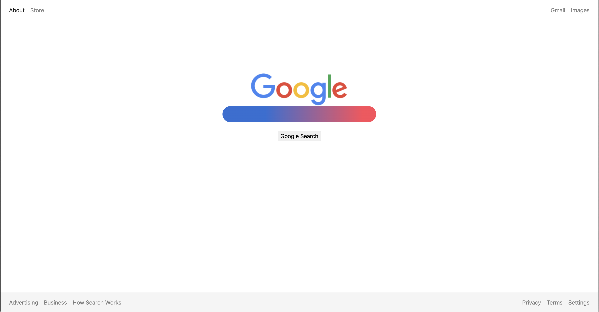
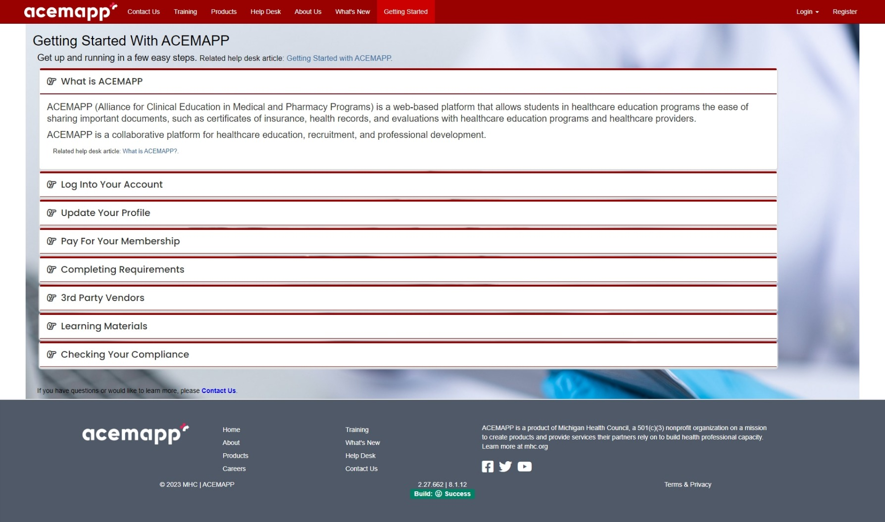
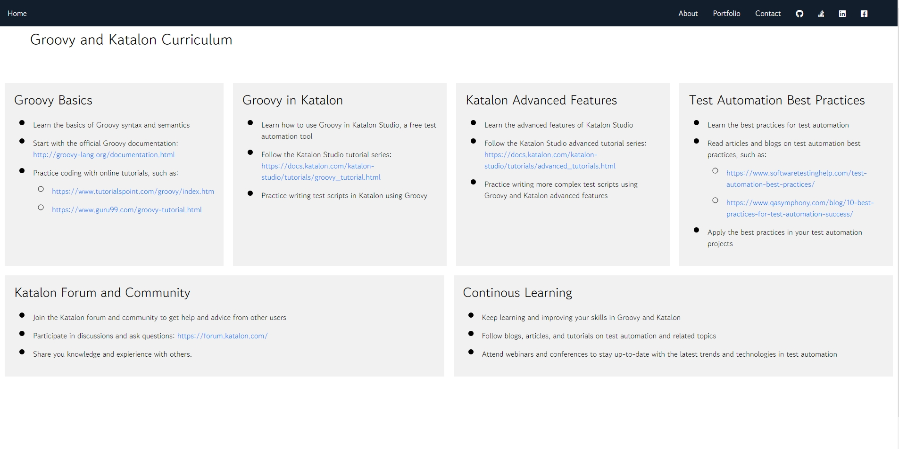
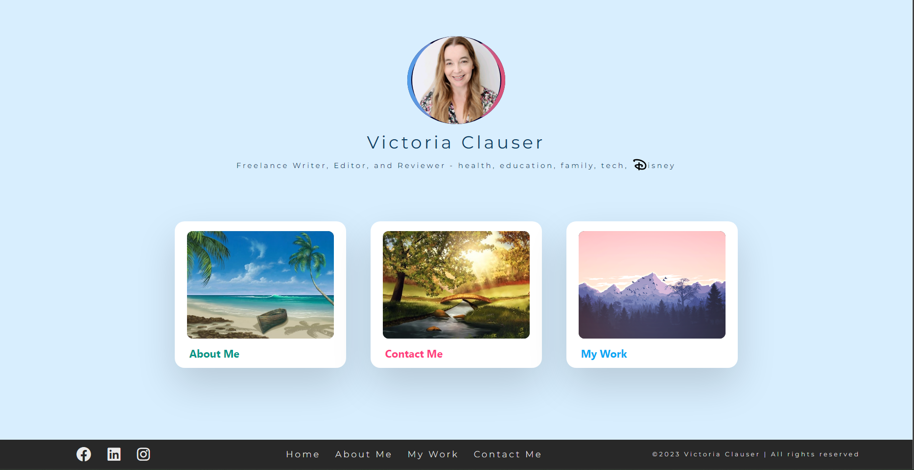

# Brian Clauser

## About Me

My personal site I use for practice and creating a portfolio of sorts.

This project originally started off as a [Jekyll](https://jekyllrb.com) project.

As an experienced Quality Assurance professional, I specialize in testing and ensuring the quality of Web Applications. I have a strong attention to detail and meticulously work to ensure that every aspect of the application is functional and meets high standards of quality.

In addition to my expertise in Quality Assurance, I also have skills in front-end web design. I have experience creating window applications, interactive dashboards, and data visualizations that are both visually appealing and functional.

I stay up-to-date with the latest technologies and best practices in the field of web development to provide innovative designs that meet your unique needs. I have a passion for delivering exceptional work and am committed to providing designs that exceed your expectations.

In my free time, I enjoy visiting Disney World to recharge my creative energy and escape from the stresses of work.

## Portfolio

## Understanding Cerebral Palsy

### What is Cerebral Palsy?

Cerebral Palsy (CP) is a neurological disorder that affects movement and coordination. It is caused by damage to the brain, usually before or during birth, and can range from mild to severe in its impact on the individual. CP is a life-long condition, but with proper support and treatment, many people with CP can live full and fulfilling lives.

### Symptoms of CP

- Difficulty with fine motor skills such as writing or using utensils
- Difficulty with gross motor skills such as walking or balancing
- Stiff or spastic movements
- Difficulty with speech and communication
- Seizures

### Treatment Options

Treatment for CP depends on the individual and the severity of their symptoms. Some common forms of treatment include:

- Physical therapy to improve movement and coordination
- Occupational therapy to improve fine motor skills and daily living activities
- Speech therapy to improve communication and speech
- Medications to manage symptoms such as spasticity or seizures
- Surgery to correct physical deformities or to relieve spasticity

## Contact

To get in touch, please fill out the contact form below:

[Contact Form](https://formspree.io/f/xjvlrzgp)

---

This portfolio page was created by Brian Clauser. For more information, you can visit my [GitHub profile](https://github.com/bdclauser), [Stack Overflow profile](https://stackoverflow.com/users/18369883/pzljug), [LinkedIn profile](https://www.linkedin.com/in/brian-clauser/), or [Facebook page](https://www.facebook.com/brian.d.clauser/).

